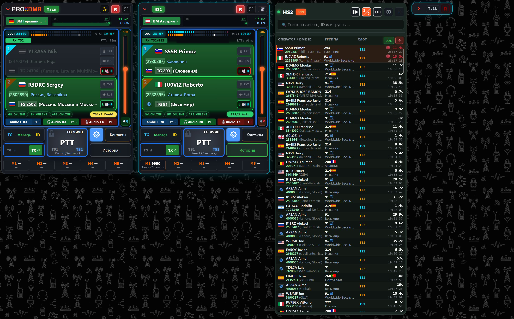
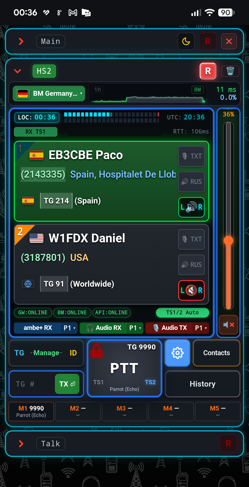
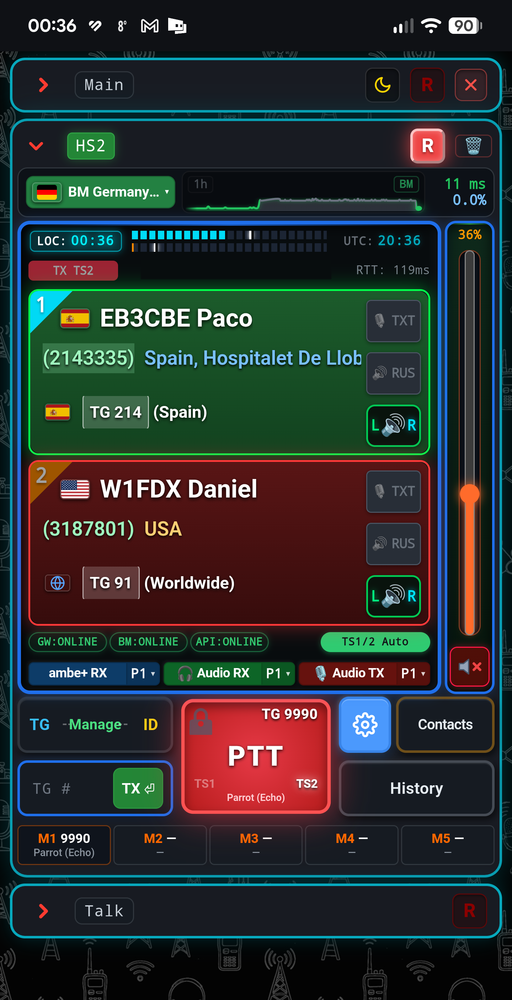

# ProxDMR

ProxDMR is a client-server application that turns an ordinary web browser or smartphone into a full-featured DMR transceiver. The program connects directly to the **BrandMeister** amateur radio network via the Homebrew/MMDVM protocol, eliminating the need for a physical digital radio or hardware hotspot.

<p align="center">
  <a href="docs/images/01.jpg" target="_blank">
    
  </a>
</p>

<p align="center">
  <a href="docs/images/02.png" target="_blank">
    
  </a>
  <a href="docs/images/03.png" target="_blank">
    
  </a>
</p>

### Features:
* **No physical radio, MMDVM modem, or hardware USB vocoder (DVStick) is required to operate on DMR** — Voice encoding and decoding are performed entirely on the server via a software AMBE+2 vocoder..
* **Access via any modern web browser** (PC, laptop, tablet) or through a dedicated Android application (APK).
* **Multi-Hotspot Architecture** — Run multiple independent virtual hotspots simultaneously on one screen, listening to different timeslots (TS1 and TS2) and talkgroups.
* **Ultra-low latency audio** — Voice streams are transmitted to the client in compressed form (Opus, WebRTC, WebSocket) with low latency of just tens of milliseconds.
* **A single server database** for users, access permissions, and QSO audio recordings.
* **Network PTT transmission using Push-to-Talk** (PTT button on the screen or Space key on PC).
* **Support for two timeslots (TS1 and TS2)**, dynamic and static talkgroups.
* **Automatic transmission time limit** (Time-Out Timer).
* **BrandMeister API v2 integration** — Manage talkgroup subscriptions directly from the interface (connect, disconnect, drop active/hung calls).
* **Real-time network diagnostics** — Live monitoring of connection status and ping to the master server with an interactive latency chart.
* **Microphone Automatic Gain Control (AGC)**.
* **Built-in RadioID callsign database** with automatic local synchronization (312,000+ radio amateurs).
* **Audio recording player** with instant search and filtering by callsign, date, and group.
* **Speech recognition** and live transcription of conversations into text.
* **Translation and voice readout** of transcribed dialogues into multiple languages.

---

## Table of Contents

1. [Package Contents](#1-package-contents)
2. [Prerequisites](#2-prerequisites)
3. [Installation — Choose Your Method](#3-installation--choose-your-method)
   * [A. Linux / Raspberry Pi (Terminal)](#a-linux--raspberry-pi-terminal)
   * [B. Windows (Docker Desktop)](#b-windows-docker-desktop)
   * [C. Synology NAS — via GUI (Container Manager)](#c-synology-nas--via-gui-container-manager)
   * [D. Synology NAS — via SSH](#d-synology-nas--via-ssh)
   * [E. Manual Start via Docker Compose (Any OS)](#e-manual-start-via-docker-compose-any-os)
   * [F. Run via Pre-Built Docker Image](#f-run-via-pre-built-docker-image)
4. [First Launch and Sign In](#4-first-launch-and-sign-in)
5. [BrandMeister Hotspot Configuration](#5-brandmeister-hotspot-configuration)
6. [Piper Speech Synthesis (TTS) Voices](#6-piper-speech-synthesis-tts-voices)
7. [Android Application](#7-android-application)
8. [Data Persistence & Storage](#8-data-persistence--storage)
9. [Upgrading to a New Version](#9-upgrading-to-a-new-version)
10. [Backup & Restore](#10-backup--restore)
11. [Security Recommendations](#11-security-recommendations)
12. [Useful Commands](#12-useful-commands)

---

## 1. Package Contents

Two release archives are provided with **identical contents**:

| Archive | Intended For |
|---|---|
| `ProxDMR-Release.tar.gz` | Linux, Raspberry Pi, Synology NAS |
| `ProxDMR-Release.zip` | Windows (Docker Desktop) |

---

## 2. Prerequisites

* **Docker** 20.10+ and **Docker Compose v2** (built into Docker Desktop and Synology Container Manager).
* **Architecture:** x86_64 or ARM64 (Raspberry Pi 4/5, modern ARM Synology NAS). The AMBE+2 vocoder compiles directly inside the container for your hardware.
* **Internet Connection** during initial launch: downloads the base Python image, packages, RadioID database, and required Piper voices.
* **Available Ports** on your host:

| Port | Protocol | Purpose |
|---|---|---|
| `8266` | TCP | Web interface and Android app (HTTPS/WSS) |
| `62031` | UDP | HomeBrew protocol exchange with BrandMeister master server |

* **BrandMeister Account** and amateur radio credentials: Callsign, DMR ID, and Hotspot Security Password (from your profile on brandmeister.network).

---

## 3. Installation — Choose Your Method

During interactive setup, you will be prompted for:

| Prompt | What to Enter |
|---|---|
| Host IP or domain for SSL | Local IP of your server (auto-detected default provided) |
| Web interface port | `8266` (Press Enter) |
| Admin username | `admin` or your callsign |
| Admin password | **Enter your secure password** |

> ⚠️ **Admin Password:** Configured upon first startup. Once logged in, you can change your password at any time directly in the web UI under **Settings → My Account → Security & Password**. Changing `ADMIN_PASSWORD` in `.env` later will not affect existing users in the database.

### A. Linux / Raspberry Pi (Terminal)

```bash
tar -xzf ProxDMR-Release.tar.gz
cd ProxDMR
chmod +x setup.sh
./setup.sh
```

The script verifies Docker, generates `.env`, asks the prompts above, builds, and launches the container. Upon completion, it outputs your login URL.

If Docker is not yet installed (Debian/Ubuntu/Raspberry Pi OS):
```bash
curl -fsSL https://get.docker.com | sh
sudo usermod -aG docker $USER   # then log out and back in
```

### B. Windows (Docker Desktop)

1. Install **Docker Desktop** (<https://www.docker.com/products/docker-desktop/>) and start it. Ensure Docker is running in the system tray.
2. Extract `ProxDMR-Release.zip` (for example to `C:\ProxDMR`).
3. Open the `ProxDMR` folder and double-click **`setup.bat`**.  
   Alternatively, in PowerShell:
   ```powershell
   cd C:\ProxDMR\ProxDMR
   powershell -ExecutionPolicy Bypass -File .\setup.ps1
   ```
4. Follow the setup prompts and wait for the launch confirmation.

*If Windows Defender Firewall prompts for Docker/`com.docker.backend`, allow access on **Private networks** so other local devices can connect.*

### C. Synology NAS — via GUI (Container Manager)

No SSH or archive downloading required. Use the official pre-built image directly in Container Manager:

1. In **File Station**, create a project folder (e.g. `docker/proxdmr`).
2. Open **Container Manager → Project → Create**.
   * **Project Name**: `proxdmr`
   * **Path**: select `docker/proxdmr`
   * **Source**: select **Create docker-compose.yml**
3. Paste the following configuration directly into the editor:
   ```yaml
   version: '3.8'

   services:
     proxdmr:
       image: ghcr.io/owlze/proxdmr:latest
       container_name: proxdmr
       restart: unless-stopped
       ports:
         - "8266:8266"
         - "62031:62031/udp"
       volumes:
         - ./config:/app/config
         - ./data:/app/data
       environment:
         - HOST_IP=192.168.1.50       # Your Synology local IP
         - ADMIN_USER=admin
         - ADMIN_PASSWORD=YourSecurePassword
   ```
4. Click **Next** → uncheck "Web portal" → **Done**.  
   Container Manager will pull the pre-built image from GitHub Container Registry and start ProxDMR in seconds.
5. If DSM Firewall is enabled (*Control Panel → Security → Firewall*), ensure incoming `8266/TCP` and `62031/UDP` are allowed.

### D. Synology NAS — via SSH

Connect to your NAS via SSH and clone directly from GitHub:

```bash
git clone https://github.com/owlze/proxdmr.git /volume1/docker/proxdmr
cd /volume1/docker/proxdmr
chmod +x setup.sh
./setup.sh
```

### E. Manual Start via Docker Compose (Any OS)

```bash
cp .env.example .env        # Windows: copy .env.example .env
```

Edit `.env` to set `HOST_IP` (your server IP or domain), `ADMIN_USER`, and `ADMIN_PASSWORD`. Then:

```bash
docker compose up -d --build
```

### F. Run via Pre-Built Docker Image

If you prefer not to build locally:

```bash
docker run -d \
  --name proxdmr \
  --restart unless-stopped \
  -p 8266:8266 \
  -p 62031:62031/udp \
  -v proxdmr_config:/app/config \
  -v proxdmr_data:/app/data \
  -e HOST_IP=192.168.1.50 \
  -e ADMIN_USER=admin \
  -e ADMIN_PASSWORD=YourSecurePassword \
  ghcr.io/owlze/proxdmr:latest
```

---

## 4. First Launch and Sign In

1. Allow 1–2 minutes after initial start: the container generates TLS certificates, session signing keys, initializes user database schemas, and downloads the RadioID database.  
   Monitor logs with: `docker compose logs -f` (exit with `Ctrl+C`).
2. Open your web browser:
   ```text
   https://<SERVER_IP>:8266
   ```
3. **Browser Certificate Warning:** The service generates a local self-signed TLS certificate required by browsers for Web Audio and microphone access. Click *Advanced → Proceed to site*.
4. Sign in with the credentials specified during setup.

---

## 5. BrandMeister Hotspot Configuration

In the web interface, open hotspot settings and configure:

| Field | Description |
|---|---|
| **Callsign** | Your licensed amateur radio callsign |
| **DMR ID** | Your DMR ID (registered via radioid.net) |
| **BM Password** | *Hotspot Security Password* from your brandmeister.network profile |
| **BM Master Host** | Closest master server (default `2322.master.brandmeister.network`) |

Click **Save** — the gateway will connect to BrandMeister. Multiple virtual hotspots can be configured simultaneously.

---

## 6. Piper Speech Synthesis (TTS) Voices

Voice models are downloaded on demand:

* Open speech synthesis (TTS) settings and choose a voice model — it downloads automatically in the background.
* Downloaded models are cached in `config/piper_voices/` and persist across container restarts and updates.

---

## 7. Android Application

The mobile app provides a native Android client with low-latency PTT and background audio service.

1. **Download APK** from your server:
   ```text
   https://<SERVER_IP>:8266/download/apk
   ```
   *(or use `src/static/ProxDMR.apk` from the release archive).*
2. Allow installation from unknown sources on your Android device and install the package.
3. On first run, enter:
   * **Server IP or domain**;
   * **Port** (default `8266`);
   * Tailscale VPN auto-connect preference (if accessing remotely).
4. Enter your login credentials. The application persists session tokens for seamless reconnects.

---

## 8. Data Persistence & Storage

All user configurations and persistent records reside **outside the container**, preserving data across updates:

| Path | Contents |
|---|---|
| `.env` | Environment configuration (host IP, ports, admin credentials) |
| `config/proxdmr.db` | SQLite database (users, settings, call logs) |
| `config/jwt_secret.key` | JWT session encryption key |
| `config/cert.pem`, `config/key.pem` | TLS certificates |
| `config/recordings/` | Audio recordings (`.wav`) |
| `config/piper_voices/` | Cached Piper TTS voice models |
| `data/` | RadioID database and TalkGroup cache |

---

## 9. Upgrading to a New Version

1. Stop the service and create a backup (see Section 10):
   ```bash
   docker compose down
   ```
2. Extract the new archive over your installation directory. Existing `.env`, `config/`, and `data/` directories will remain untouched.
3. Rebuild and launch:
   ```bash
   docker compose up -d --build
   ```
4. Database migrations apply automatically upon startup.
5. Update the Android app via `/download/apk` if a new APK version is available.

---

## 10. Backup & Restore

To back up, stop the service and copy **`config/`**, **`data/`**, and **`.env`**.  
To restore, copy these items back into the project root and run `docker compose up -d`.

---

## 11. Security Recommendations

* Prefer accessing your server remotely through a **VPN (Tailscale / WireGuard)** rather than opening public WAN ports.
* Always use a strong, unique password for your administrator account.
* Never share `.env` or `config/` files, as they contain passwords and session keys.

---

## 12. Useful Commands

```bash
docker compose logs -f              # Follow logs in real time
docker compose ps                   # View container status
docker compose restart              # Restart service
docker compose down                 # Stop service
docker compose up -d --build        # Rebuild and start in background
```
