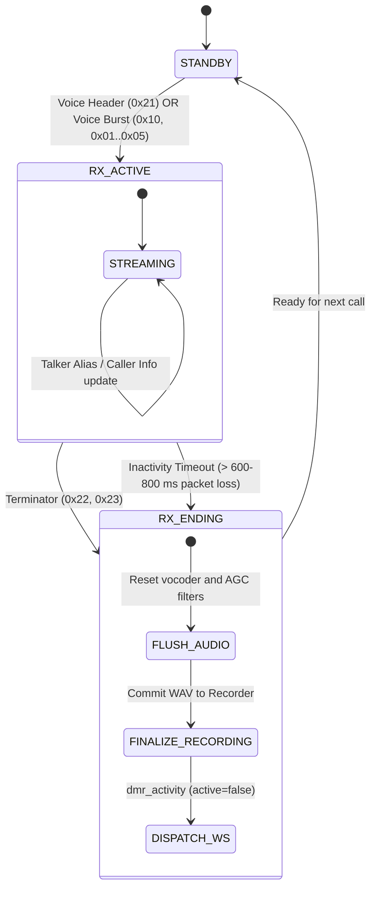

# ProxDMR: System Specification & Logical Contract (SYSTEM_SPEC)

> **Status**: Mandatory reference for developers and AI agents.  
> **Purpose**: Single Source of Truth for architecture, protocols, state machines, and system invariants.  
> **Rule**: Any code modifications must strictly conform to this specification. If application logic changes, this document must be updated first.

---

## 1. High-Level Architectural Overview

The **ProxDMR** system comprises the following layers:

```
[ BrandMeister DMR Network ] ◄──(UDP 62031 HomeBrew)──► [ Python Gateway (FastAPI / asyncio) ]
                                                                  │
                                ┌────────────────────────────────┼────────────────────────────────┐
                                ▼                                ▼                                ▼
                       [ DSD-FME Vocoder ]              [ Audio Pipeline ]              [ SQLite proxdmr.db ]
                     (libambe_vocoder.so)             (AGC, Equalizer, WAV)           (History, logs, users)
                                │                                │                                │
                                └────────────────────────────────┼────────────────────────────────┘
                                                                 │
                                                    (WSS 8266 JSON + PCM)
                                                                 ▼
                                                   [ Frontend Vanilla JS SPA ]
                                              (WebAudio API, UI Cards, PTT Engine)
```

1. **Backend (Python 3.12, FastAPI, asyncio)**:
   - `src/dmr/homebrew.py` — HomeBrew/MMDVM network protocol stack (UDP client to BrandMeister).
   - `src/dmr/manager.py` — Hotspot coordinator (`HotspotManager`), timeslot routing (TS1/TS2), auto-reconnect, TG/call tracking.
   - `src/dmr/vocoder.py` — Wrapper around the native `libambe_vocoder.so` C library (DSD-FME) decoding AMBE+2 into Linear PCM 8000 Hz 16-bit.
   - `src/dmr/recorder.py` — Real-time streaming WAV recording, storage quotas, call log persistence.
   - `src/dmr/transcriber.py` — Local offline speech-to-text transcription (Whisper).
   - `src/dmr/ping.py` — Background latency and jitter monitoring to BrandMeister master servers.

2. **Frontend (HTML5, CSS3, Vanilla JS SPA)**:
   - `src/templates/index.html` — Single page application container and modals.
   - `src/static/js/app.js` — Core application controller, hotspot card states, WebSocket handling.
   - `src/static/js/audio-player.js` — Ring buffer WebAudio API engine for jitter-free 8 kHz PCM playback.

3. **Deployment Environment**:
   - Docker container `proxdmr` (Linux / Raspberry Pi / Synology NAS / Windows).
   - Folders `config` and `data` mounted as persistent volumes outside the container.

---

## 2. DMR HomeBrew Protocol: Frame Type Matrix

In the HomeBrew protocol, a packet starts with the prefix `b"DMRD"` ($\ge 53$ bytes).  
The frame type is defined at offset byte 15: `frame_type = slot_byte & 0x3F`.

### Complete Frame Type Table (`frame_type`):

| Byte (`Hex`) | Byte (`Dec`) | Role / Name | Stream Description | Critical Backend Action |
| :--- | :--- | :--- | :--- | :--- |
| `0x10` | 16 | **Voice Sync (Burst A)** | First burst of 6-burst superframe. Carries sync. | Start call if new, decode AMBE. |
| `0x01` | 1 | **Voice Burst B** | Second burst of superframe (AMBE audio). | Decode AMBE audio. |
| **`0x02`** | **2** | **Voice Burst C** | **Third burst of superframe (AMBE audio).** | **STRICTLY: Decode audio! THIS IS NOT A TERMINATOR!** |
| `0x03` | 3 | **Voice Burst D** | Fourth burst of superframe (AMBE audio). | Decode AMBE audio. |
| `0x04` | 4 | **Voice Burst E** | Fifth burst of superframe (AMBE audio). | Decode AMBE audio. |
| `0x05` | 5 | **Voice Burst F** | Sixth burst of superframe (AMBE audio). | Decode AMBE audio. |
| `0x21` | 33 | **Voice LC Header** | Call header (DataSync `0x20` + `1`). Carries TG, source ID. | Initialize call, parse IDs and TG. |
| **`0x22`** | **34** | **Terminator with LC** | **End of transmission (DataSync `0x20` + `2`).** | **Finalize call, flush vocoder, save recording.** |
| **`0x23`** | **35** | **Terminator without LC**| **End of transmission (DataSync `0x20` + `3`).** | **Finalize call, flush vocoder, save recording.** |

> [!CAUTION]
> **GOLDEN RULE**: `frame.frame_type == 2` represents **Voice Burst C** (arrives every 360 ms during normal voice).  
> Terminator checks MUST require the synchronization bit `0x20`:
> `is_terminator = (frame.frame_type in (0x22, 0x23)) or (bool(frame.frame_type & 0x20) and (frame.frame_type & 0x0F) in (2, 3))`

---

## 3. Call State Machine

Each timeslot (TS1 and TS2) of every hotspot operates an independent state machine:



### Safety Invariants:
1. **Debounce (350 ms)**: If a timeslot is actively receiving (`slot_state.active == True`), packets from a mismatched `stream_id` or `src_id` are ignored if less than 350 ms have elapsed since the last valid burst (protects against packet collision and duplication).
2. **Minimum Call Duration**: Transmissions shorter than `0.5` seconds without valid decoded audio or text are omitted from audible history.
3. **Vocoder Reset**: Upon exiting `RX_ACTIVE`, vocoder and DSP filters (`rt.vocoder.reset_slot(slot)`, `rt.agc.reset_slot(slot)`) must be reset so residual audio samples never bleed into the next transmission.

---

## 4. Multi-Hotspot Scoping Invariants

The system allows configuring multiple concurrent hotspots (e.g. `default` (Main), `80af0d10` (Hotspot 2), etc.).

### Scoping Rules:
1. **Independent Hotspot Processes**:
   - Each hotspot runs its own `HomeBrewService` instance, UDP socket, and BrandMeister session.
   - Each hotspot maintains separate DSD-FME vocoder instances and slot audio buffers.
2. **UI Scoping**:
   - DOM state is scoped strictly to `.radio-container[data-hotspot-id="{hid}"]`.
   - **Transcription Indicator ("t")**: Scoped strictly to the specific card where transcription is enabled.
   - **Recording Toggle ("R")**: State is persisted per-hotspot (`proxdmr_hs_{hid}_rec`).
   - **Volume & Mute**: Sliders operate independently per hotspot and timeslot.
3. **Hotspot Collapsing & Startup Behavior**:
   - **Standard Collapse (Quick click on chevron `v`)**:
     - Collapses the card into a compact bar with red indicator.
     - Fully disconnects from BrandMeister, mutes audio, sets status to `DISCONNECTED`.
     - Automatically closes the log panel and stops recording playback.
   - **Background Collapse (Long press on chevron $\ge 450$ ms)**:
     - Visually minimizes the card into a slim status badge with emerald border (`#00e676`).
     - Maintains active connection in background (BM connected, audio playing, transcription active).
     - Keeps log window open and preserves playback.
   - **Startup Behavior**:
     - Restores user's saved open/collapsed card layout from `localStorage`. Defaults to primary hotspot expanded, secondary hotspots collapsed.

---

## 5. WebSocket Contracts (Backend ◄──► Frontend)

Real-time communication occurs over WebSocket (`/ws` on port `8266`).

### 5.1. Binary Audio Packet (Server ──► Client)
Dispatched whenever a voice burst is decoded:

| Offset | Length | Type | Value |
| :--- | :--- | :--- | :--- |
| `0` | 1 byte | `uint8` | Timeslot (`1` or `2`) |
| `1` | 1 byte | `uint8` | Hotspot ID string length (`hid_len`, $N$) |
| `2` | $N$ bytes | `UTF-8 string` | Hotspot Identifier (e.g. `"default"`) |
| `2 + N` | to end | `int16 LE PCM` | Linear PCM audio: 8000 Hz, mono, 16-bit |

### 5.2. Core JSON Messages (Server ──► Client)

- **`init`**: Full state payload upon initial connection (hotspot list, latency, call logs, settings).
- **`dmr_activity`**: Transmission state change:
  ```json
  {
    "type": "dmr_activity",
    "hotspot_id": "default",
    "slot": 1,
    "active": true,
    "src_id": 2500438,
    "src_callsign": "R3XCS",
    "dst_id": 2501,
    "call_id": "1790411891156_2500438_1"
  }
  ```
  On call completion: `active: false`, with `"duration": 5.9` and `"discard": false`.
- **`bm_status`**: BrandMeister connection status (`"CONNECTING"`, `"AUTHENTICATING"`, `"ONLINE"`, `"DISCONNECTED"`).
- **`recording_saved`**: Notification when audio recording is committed to storage.
- **`transcription`**: Transcribed speech text for a specific `call_id`.

### 5.3. Core JSON Commands (Client ──► Server)
- **`bm_connect` / `bm_disconnect`**: Connect or disconnect hotspot (`hotspot_id`).
- **`hotspot_collapse`**: Persist card collapse state.
- **`ptt_start` / `ptt_stop`**: Voice transmission from browser microphone.
- **`tg_set`**: Set dynamic or static TalkGroup for a timeslot.

---

## 6. Frontend Rules & DOM Best Practices

1. **No direct global queries for card elements**:
   - Never call `document.querySelector(".vfo-ts1-row")` without specifying the parent card container. Always use `targetCard.querySelector(".vfo-ts1-row")`.
2. **Event Delegation**:
   - Card buttons (settings gear, connect button, timeslot selectors) must be bound through event delegation on parent containers or re-initialized cleanly in `renderHotspotsList()`.

---

## 7. Pre-Flight Checklist Before Release

Before finalizing any changes, verify:
1. **Python Syntax**: Verify compilation of all modified backend files (`python -m py_compile ...`).
2. **JavaScript Syntax**: Ensure clean browser console without syntax errors or unhandled promises.
3. **SSH Commands**: When testing on remote servers, ensure all commands use reasonable timeouts.
4. **Live Verification**:
   - Confirm hotspots reach `ONLINE` status.
   - Verify incoming audio plays cleanly and call recordings are persisted properly.
