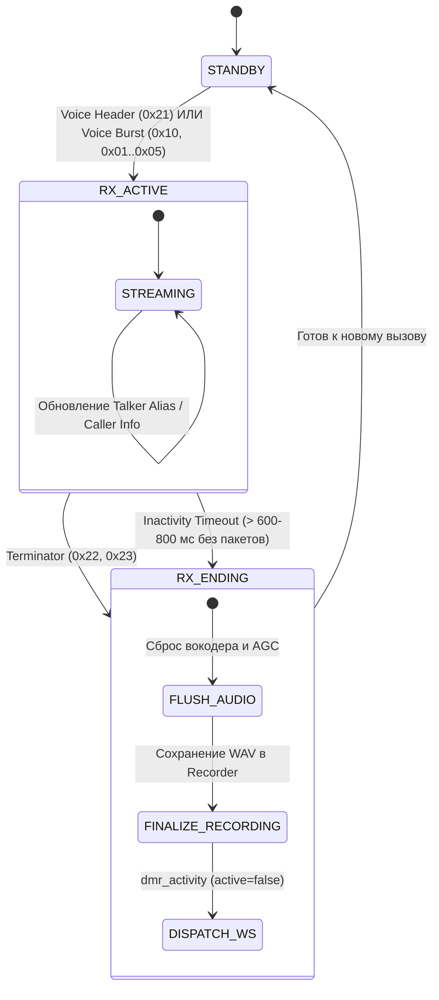

# ProxDMR: Системная спецификация и логический контракт (SYSTEM_SPEC)

> **Статус**: Обязательный справочник для разработчиков и AI-агентов.  
> **Назначение**: Единый источник правды (Single Source of Truth) архитектуры, протоколов, матриц состояний и инвариантов системы.  
> **Правило**: Любые изменения в коде должны соответствовать данной спецификации. При изменении логики в коде данный документ должен обновляться в первую очередь.

---

## 1. Архитектурный обзор (High-Level Overview)

Система **ProxDMR** состоит из следующих уровней:

```
[ DMR Сеть BrandMeister ] ◄──(UDP 62031 HomeBrew)──► [ Python Gateway (FastAPI / asyncio) ]
                                                                 │
                                ┌────────────────────────────────┼────────────────────────────────┐
                                ▼                                ▼                                ▼
                       [ DSD-FME Vocoder ]              [ Audio Pipeline ]              [ SQLite proxdmr.db ]
                     (libambe_vocoder.so)             (AGC, Equalizer, WAV)           (История, записи, юзеры)
                                │                                │                                │
                                └────────────────────────────────┼────────────────────────────────┘
                                                                 │
                                                    (WSS 8266 JSON + PCM)
                                                                 ▼
                                                  [ Frontend Vanilla JS SPA ]
                                             (WebAudio API, UI Cards, PTT Engine)
```

1. **Backend (Python 3.12, FastAPI, asyncio)**:
   - `src/dmr/homebrew.py` — сетевой стек протокола HomeBrew/MMDVM (клиент протокола BrandMeister по UDP).
   - `src/dmr/manager.py` — координатор хотспотов (`HotspotManager`), маршрутизация таймслотов (TS1/TS2), автоподключение, трекинг TG/вызовов.
   - `src/dmr/vocoder.py` — обертка над нативной C-библиотекой `libambe_vocoder.so` (DSD-FME) для декодирования AMBE+2 в Linear PCM 8000 Hz 16-bit.
   - `src/dmr/recorder.py` — потоковая запись вызовов в WAV, квоты хранилища, ведение базы записей.
   - `src/dmr/transcriber.py` — локальная оффлайн-транскрибация речи (Whisper).
   - `src/dmr/ping.py` — фоновый мониторинг пинга и джиттера до серверов BrandMeister.

2. **Frontend (HTML5, CSS3, Vanilla JS SPA)**:
   - `src/templates/index.html` — единая страница веб-приложения и модальные окна.
   - `src/static/js/app.js` — контроллер интерфейса, состояние карточек хотспотов, обработка WebSocket.
   - `src/static/js/audio-player.js` — кольцевой буфер WebAudio API для воспроизведения PCM 8kHz без щелчков и задержек.

3. **Среда развертывания**:
   - Docker-контейнер `proxdmr` на Synology NAS (`/volume4/scripts/ProxDMR`).
   - Папки `src` и `config` смонтированы внутрь контейнера как bind mounts.

---

## 2. Протокол DMR HomeBrew: Матрица типов фреймов

В протоколе HomeBrew пакет данных начинается с префикса `b"DMRD"` (длина $\ge 53$ байт).  
Тип кадра определяется байтом смещения 15: `frame_type = slot_byte & 0x3F`.

### Полная таблица типов фреймов (`frame_type`):

| Байт (`Hex`) | Байт (`Dec`) | Название / Роль | Описание в потоке | Критическое действие бэкэнда |
| :--- | :--- | :--- | :--- | :--- |
| `0x10` | 16 | **Voice Sync (Burst A)** | Первый бёрст 6-бёрстового суперфрейма. Несёт синхронизацию. | Начать вызов (если не начат), декодировать AMBE. |
| `0x01` | 1 | **Voice Burst B** | Второй бёрст суперфрейма (AMBE аудио). | Декодировать AMBE аудио. |
| **`0x02`** | **2** | **Voice Burst C** | **Третий бёрст суперфрейма (AMBE аудио).** | **СТРОГО: Декодировать аудио! ЭТО НЕ ТЕРМИНАТОР!** |
| `0x03` | 3 | **Voice Burst D** | Четвёртый бёрст суперфрейма (AMBE аудио). | Декодировать AMBE аудио. |
| `0x04` | 4 | **Voice Burst E** | Пятый бёрст суперфрейма (AMBE аудио). | Декодировать AMBE аудио. |
| `0x05` | 5 | **Voice Burst F** | Шестой бёрст суперфрейма (AMBE аудио). | Декодировать AMBE аудио. |
| `0x21` | 33 | **Voice LC Header** | Заголовок вызова (DataSync `0x20` + `1`). Передаёт TG, ID источника. | Инициализировать вызов, распарсить ID и TG. |
| **`0x22`** | **34** | **Terminator with LC** | **Окончание передачи (DataSync `0x20` + `2`).** | **Завершить вызов, сбросить вокодер, сохранить запись.** |
| **`0x23`** | **35** | **Terminator without LC**| **Окончание передачи (DataSync `0x20` + `3`).** | **Завершить вызов, сбросить вокодер, сохранить запись.** |

> [!CAUTION]
> **ЖЕЛЕЗНОЕ ПРАВИЛО**: Значение `frame.frame_type == 2` означает **Voice Burst C** (приходит каждые 360 мс во время нормальной речи).  
> Проверка на терминатор ОБЯЗАНА требовать установленный бит синхронизации `0x20`:
> `is_terminator = (frame.frame_type in (0x22, 0x23)) or (bool(frame.frame_type & 0x20) and (frame.frame_type & 0x0F) in (2, 3))`

---

## 3. Граф состояний вызова (Call State Machine)

Каждый таймслот (TS1 и TS2) каждого хотспота обладает независимым автоматом состояний:



### Защитные инварианты автомата:
1. **Debounce (350 мс)**: Если на слоте уже идет вызов (`slot_state.active == True`), пакеты от чужого `stream_id` или `src_id` игнорируются, если с момента последнего валидного бёрста прошло менее 350 мс (защита от коллизий и дублей пакетов).
2. **Минимальная длительность**: Вызовы короче `0.5` секунды без распознанного текста отбрасываются из истории слышимых станций.
3. **Сброс вокодера**: При выходе из `RX_ACTIVE` вокодер и фильтры слота (`rt.vocoder.reset_slot(slot)`, `rt.agc.reset_slot(slot)`) обязаны быть сброшены, чтобы остаточные сэмплы не перетекли в следующий вызов.

---

## 4. Мульти-хотспотная изоляция (Hotspot Scoping Invariants)

В системе одновременно может быть сконфигурировано несколько хотспотов (например: `default` (Main), `80af0d10` (Hotspot 2) и т.д.).

### Правила изоляции:
1. **Каждый хотспот — свой независимый процесс**:
   - Имеет собственный экземпляр `HomeBrewService`, сокет UDP и авторизацию на BrandMeister.
   - Имеет свой независимый экземпляр вокодера DSD-FME и свои буферы слотов TS1/TS2.
2. **Изоляция интерфейса (UI Scoping)**:
   - Любое состояние в DOM привязывается строго к селектору `.radio-container[data-hotspot-id="{hid}"]`.
   - **Индикатор транскрибации "t"**: отображается строго на карточке того хотспота, где включена транскрибация. Включение на одном хотспоте не затрагивает другие.
   - **Кнопка автозаписи "R"**: состояние кнопки хранится индивидуально для каждого хотспота (ключ `proxdmr_hs_{hid}_rec`).
   - **Громкость и Mute**: регулировки для каждого хотспота и каждого слота независимы.
3. **Сворачивание хотспотов и стартовое поведение**:
   - **Обычное сворачивание (короткий клик по кнопке `v`)**:
     - Карточка хотспота сворачивается в микропанель с красной стрелкой и красным статусом.
     - Происходит полное отключение от BrandMeister (BM), глушится звук хотспота, статус переходит в `DISCONNECTED`.
     - **Окно лога обязательно автоматически закрывается**.
     - **Если в логе работал плеер записей — плеер останавливается**.
   - **Особый режим сворачивания (удержание кнопки `v` от 450 мс)**:
     - Карточка хотспота визуально сворачивается в компактную микропанель с изумрудной рамкой и зеленой стрелкой (`#00e676`).
     - Все мероприятия по отключению и остановке НЕ происходят: хотспот продолжает полноценно работать в фоне (подключение к BM активно, звук воспроизводится, транскрибация работает).
     - Окно лога **НЕ закрывается** (остается открытым).
     - Плеер записей **НЕ останавливается**.
     - При повторном клике по микропанели или шеврону хотспот мгновенно разворачивается обратно.
   - **Стартовое поведение**:
     - При старте страницы или повторном открытии/возвращении в приложение восстанавливается последняя сохраненная пользователем комбинация открытых и свернутых хотспотов (из `localStorage`). Если для хотспота сохраненного состояния еще нет (первый запуск), то 1-й хотспот открыт, а остальные свернуты (`collapsed: true`).

---

## 5. Контракты WebSocket (Backend ◄──► Frontend)

Взаимодействие происходит по протоколу WebSocket (`/ws` на порту `8266`).

### 5.1. Бинарный аудио-пакет (Server ──► Client)
Отправляется при декодировании каждого голосового бёрста:

| Смещение | Длина | Тип | Значение |
| :--- | :--- | :--- | :--- |
| `0` | 1 байт | `uint8` | Таймслот (`1` или `2`) |
| `1` | 1 байт | `uint8` | Длина ID хотспота (`hid_len`, $N$) |
| `2` | $N$ байт | `UTF-8 string` | Идентификатор хотспота (например, `"default"`) |
| `2 + N` | до конца | `int16 LE PCM` | Аудиоданные 8000 Hz, моно, 16 бит |

### 5.2. Основные JSON-сообщения (Server ──► Client)

- **`init`**: Полная инициализация клиента при подключении (список хотспотов, пинги, история вызовов, настройки).
- **`dmr_activity`**: Изменение состояния вызова:
  ```json
  {
    "type": "dmr_activity",
    "hotspot_id": "default",
    "slot": 1,
    "active": true,
    "src_id": 2500438,
    "src_callsign": "R3XCS",
    "dst_id": 2501,
    "call_id": "1790411891156_2500438_1"
  }
  ```
  При завершении вызова `active: false`, передаются `"duration": 5.9` и `"discard": false`.
- **`bm_status`**: Статус подключения к мастеру BrandMeister (`"CONNECTING"`, `"AUTHENTICATING"`, `"ONLINE"`, `"DISCONNECTED"`).
- **`recording_saved`**: Уведомление о сохранении WAV-файла рекордером.
- **`transcription`**: Текст распознанной речи для конкретного вызова (`call_id`).

### 5.3. Основные JSON-команды (Client ──► Server)
- **`bm_connect` / `bm_disconnect`**: Подключение/отключение хотспота (`hotspot_id`).
- **`hotspot_collapse`**: Сохранение состояния свернутости карточки.
- **`ptt_start` / `ptt_stop`**: Передача в эфир с микрофона браузера.
- **`tg_set`**: Установка TalkGroup для слота.

---

## 6. Правила фронтенда и работы с DOM

1. **Запрет на прямое обращение к глобальным селекторам для динамических элементов**:
   - Никогда не делать `document.querySelector(".vfo-ts1-row")` без указания контейнера хотспота. Всегда: `targetCard.querySelector(".vfo-ts1-row")`.
2. **Делегирование событий (Event Delegation)**:
   - Кнопки внутри карточек хотспотов (шестеренка настроек, кнопка коннекта, выбор слота, индикаторы) должны навешиваться через делегирование на общий родительский контейнер или переинициализироваться при перерендере `renderHotspotsList()`.

---

## 7. Чек-лист проверки перед деплоем и сдачей (Pre-Flight Checklist)

Перед завершением любой задачи агент или разработчик ОБЯЗАН:
1. **Проверить синтаксис Python**:
   Запустить проверку измененных файлов (`python -m py_compile ...`).
2. **Проверить синтаксис JS**:
   Убедиться, что нет необъявленных переменных и ошибок в скобках.
3. **Соблюдать правила SSH**:
   Все команды по SSH обязаны иметь жесткий таймаут (10–30с для диагностики, до 5–10м для тяжелых задач).
4. **Проверить реальный эфир после перезапуска контейнера**:
   После перезапуска `proxdmr` прочитать `docker logs --tail 30` через 15–20 секунд и убедиться, что:
   - Хотспоты перешли в статус `ONLINE`.
   - Входящие вызовы не бракуются с длительностью `0.30s`.
   - Вызовы длятся нормальное время (например, 5–15 сек) и успешно сохраняются рекордером.
